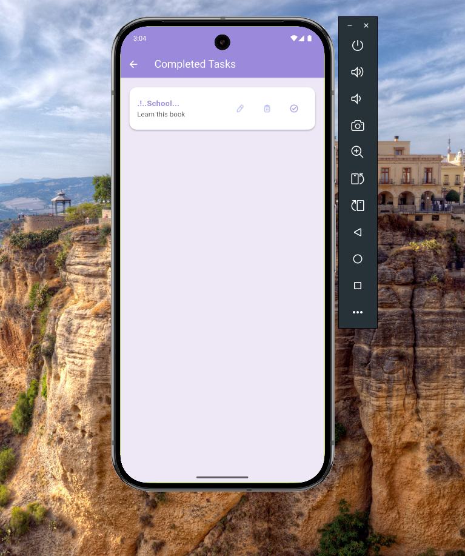
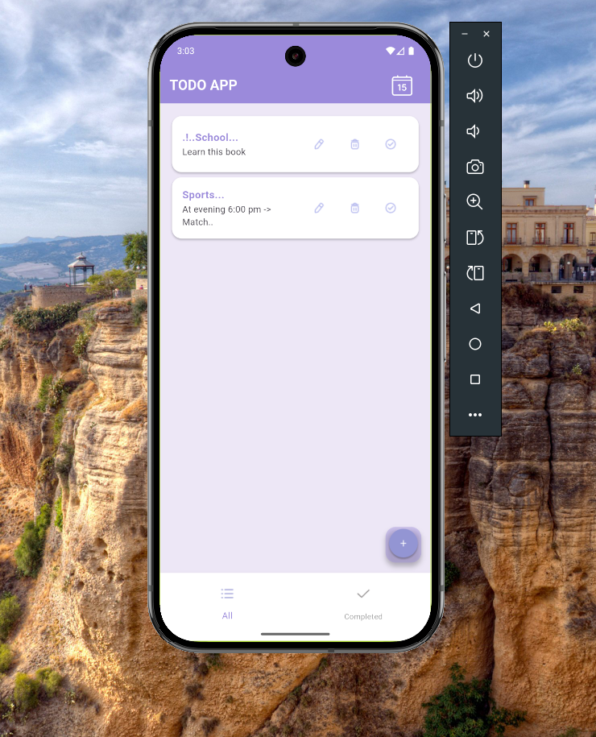
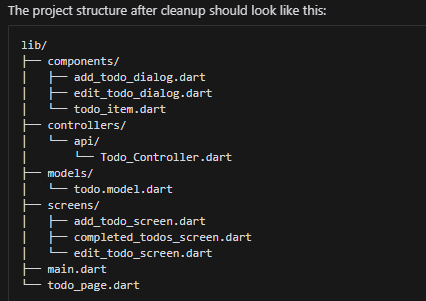

<div align="center">
  
</div>

<div align="center">
  
  
  
  
  
  
</div>

<p align="center">
  
</p>

<h2 align="center">🌟 A Modern Todo App with Beautiful UI...🌟</h2>

<p align="center">
  <b>Built with Flutter and GetX, featuring a stunning UI, smooth animations, and powerful task management capabilities.</b>
</p>

---

## ✨ Key Features

<div align="center">
  <table>
    <tr>
      <td align="center">
        <br/>
        <b>Task Management</b>
      </td>
      <td align="center">
        <br/>
        <b>Calendar Integration</b>
      </td>
      <td align="center">
        <br/>
        <b>Beautiful Animations</b>
      </td>
    </tr>
  </table>
</div>

<details>
<summary>🎯 Detailed Features</summary>

### Core Functionality
- ✅ Create, Read, Update, Delete tasks
- 📅 Calendar-based task organization
- 🔄 Real-time updates with GetX
- 💫 Smooth loading animations
- ✨ Beautiful UI components
- 📱 Responsive design
- 🌙 Task completion tracking

### Technical Features
- 🔐 State management with GetX
- 📡 RESTful API integration
- 🎨 Custom UI components
- 🔄 Loading state management
</details>

## 📱 App Showcase

<div align="center">
  <table>
    <tr>
      <td align="center">
        <br/>
        <b>Task Management</b>
      </td>
      <td align="center">
        <br/>
        <b>Add New Tasks</b>
      </td>
      <td align="center">
        <br/>
        <b>File Structure..</b>
      </td>
    </tr>
  </table>
</div>

## 🏗️ Project Architecture

<details>
<summary>📂 Project Structure</summary>

```
lib/
├── 📱 api_examples/        # API integration layer
├── 🎨 components/         # Reusable UI components
│   ├── dialogs/         # Custom dialogs
│   ├── loading/        # Loading animations
│   └── widgets/       # Shared widgets
├── 🎮 controllers/     # GetX controllers
├── 📦 models/         # Data models
├── 🖼️ screens/       # App screens
└── 📍 main.dart     # Entry point
```
</details>

## 🚀 Quick Start

<details>
<summary>📥 Installation Steps</summary>

1. **Clone the repository**
```bash
git clone https://github.com/yourusername/flutter-todo-app.git
```

2. **Navigate to project directory**
```bash
cd flutter-todo-app
```

3. **Install dependencies**
```bash
flutter pub get
```

4. **Run the app**
```bash
flutter run
```
</details>

## 💻 Technical Implementation

<details>
<summary>📡 API Integration</summary>

```dart
// API Configuration
final String baseUrl = 'https://679c68d087618946e65216b3.mockapi.io/api/todolist';

// Available Endpoints
✓ GET    /todos     # Fetch all todos
✓ POST   /todos     # Create new todo
✓ PUT    /todos/:id # Update todo
✓ DELETE /todos/:id # Remove todo
```
</details>

<details>
<summary>📦 State Management</summary>

### GetX Implementation
```dart
class TodoController extends GetxController {
  // Reactive State
  final todos = <TodoModel>[].obs;
  final isLoading = false.obs;

  // State Management
  void updateTodos() => todos.refresh();
  
  // Loading State
  void toggleLoading() => isLoading.toggle();
}
```
</details>

## 🤝 Contributing

We welcome contributions! Feel free to:

- 🐛 Report bugs
- 💡 Suggest features
- 🔧 Submit PRs

<div align="center">
  
</div>
