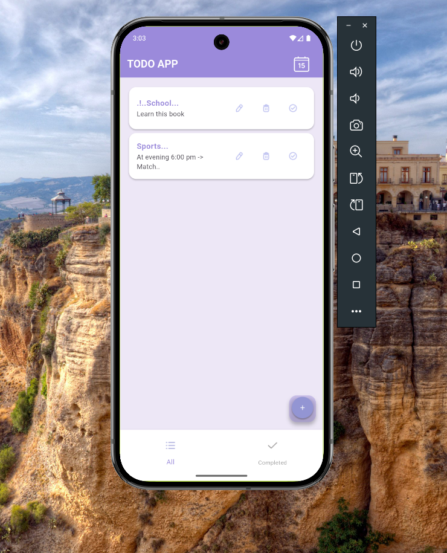
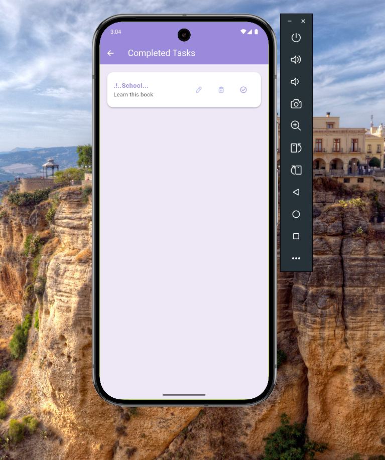

# my_app

A new Flutter project.

## Getting Started

This project is a starting point for a Flutter application.

A few resources to get you started if this is your first Flutter project:

- [Lab: Write your first Flutter app](https://docs.flutter.dev/get-started/codelab)
- [Cookbook: Useful Flutter samples](https://docs.flutter.dev/cookbook)

For help getting started with Flutter development, view the
[online documentation](https://docs.flutter.dev/), which offers tutorials,
samples, guidance on mobile development, and a full API reference.

//----------------------------------------------------------------------------------------
//-- Get Methods.. 
```
import 'package:http/http.dart' as http;

class TodoController extends GetxController {
  var todoList = RxList<TodoModel>();
  isLoading = false.obs;                        // -- Loading State..  

  @override
  void oninit() {
    super.onInit();
    getTodos();
  }

    // Get todo
    Future<RxList<TodoModel>> getTodos() async {
        isLoading.value = true;
        final response = await http.get(
        Uri.parse("https://63e9ccf2e0ac9368d644794c.mockapi.io/api/todos"));
        var data = jsonDecode(response.body.toString());

        if (response.statusCode == 200) {
        for (Map<String, dynamic> index in data) {
            todoList.add(TodoModel.fromJson(index));
        }
        isLoading.value = false;
        return todoList;
        } else {
        return todoList;
        }
    }


    inside delete there no header and no body.. 
//-----------------------------------------------------------------------
        // Post Todo
        Future<void> postTodo(title) async {
            isLoading.value = true;
        final response = await http.post(
            Uri.parse("https://63e9ccf2e0ac9368d644794c.mockapi.io/api/todos"),
            headers: {'Content-Type': 'application/json'},
            body: json.encode(
            {"todoTitle": title},
            ),
        );

        if (response.statusCode == 201) {
            print("Done");
            todoList.clear();  // Clear the list after post.. so the list will be updated.. and didn't repated the data print.. `
            getTodos();
            isLoading.value = false;
        } else {
            print('Faild');
            }
        }      

         // Delete Todo
        Future<void> deleteTodo(id) async {
            isLoading.value = true;
        final response = await http.delete(
            Uri.parse("https://63e9ccf2e0ac9368d644794c.mockapi.io/api/todos/$id"),
        );
        if (response.statusCode == 200) {
            print("Done");
            todoList.clear();
            getTodos();
            isLoading.value = false;
        } else {
            print('Faild');
            isLoading.value = false;

}

```

//----------------------------------------------------------------------------------------
        text.clear();
        get.back();
        
        
//----------------------------------



